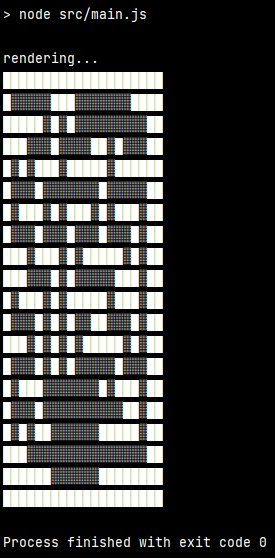

# Node Maze Generator

 

Generate perfect mazes with Node using a growing tree algorithm.

        ████████████████████
        █░██░░█░░░░░░░░░░███
        █░█░░░░░█░███░██████
        █░░░░░░░█░██░░█░░░██
        ███░░░░░█░█████░█░██
        █░░░░░░░░░█░░░░░█░██
        █░█░░░░░███░█████░██
        █░█░░░░░░░░░███░░░██
        █░█░█████████░█░█░██
        █░█░░░░░█░░░█░█░████
        █░█████░█░█░█░█░████
        █░██░░░░░░░░░░░░░░██
        █░████████░░░░░░░░██
        █░░░░░█░░░░░░░░░░░██
        █████░█░██░░░░░░░░██
        ███░░░███░░░░░░░░░██
        █░█░█████░░░░░░░░░██
        █░░░░░░░░░█░░░░░░░██
        █░░░░░█████░░░░░░░██
        ████████████████████
        
Maze.js and room.js data structures:

        {
            grid: [
              [
                Cell {
                  x: 0,
                  y: 0,
                  exits: [],
                  blocked: true,
                  displayed: false,
                  visited: false
                },
                ...
              ]
            ]
            rooms: [
                Room {
                    x: 0,
                    y: 0,
                    width: 0,
                    height: 0
                }
            ]
        }

## Installation

    npm install node-maze-generator

---

## Quick use

    const nmg = require('node-maze-generator');
    const generator = new nmg.generators.maze({}, {width: 10, height: 10});
    const renderer = new nmg.renderer(generator);

---

### Generator classes

Generator classes can be passed as an optional array of objects to the maze generator.

The shape of this data structure is as follows:

        [
            {
                generator: <generator class>,
                options: <options object>
            },
            ...
        ]

`Generator` (`src/generator.js`) will iterate over each generator class and instantiate it.

**Example**

The following example shows how to generate a maze with rooms using the provided room generator.

(also see main.js)

    const nmg = require('node-maze-generator');
    const generator = new nmg.generators.generator([
        {
            generator: nmg.generators.maze,
            options: {
                ...
            },
            generator: nmg.generators.room,
            options: {
            ...
            }
        }
    ]});
    new nmg.renderer(generator);

#### Multi-floor maze

Use the `floors` option to generate a multi-floor maze.

Use the `src.generators.stairs` generator to connect the floors with stairs.

    Floor 0
    █████████████████████
    █░░░██░░░░░░░░░░░░░░█
    ███░█████████░█████░█
    ███░█░░░░░░░█░███░░░█
    █░█░█░█████░█░█░█░███
    █░░░█░░░███░░░█░█░░░█
    █░█████░█░█████░███░█
    █░█⚙░░░░█░░░░░░░░░█░█
    █░█░█████░███████░█░█
    █░█░░░░░█░░░░░███░░░█
    █░█████░█████░█░█████
    █░░░░░░░░░░░░░░░░░███
    ███░░███░░░░░░███░█░█
    █░░░░░░░░░█░░░░░█░░░█
    █░█░░░█░███████░███░█
    █░█░░░█░█░░░░░█░░██░█
    █░█░███░█░███░█████░█
    █░█⚙░░█░█░███░░░░░░░█
    █░███░█░█░█░█████████
    █░░░░░█░░░░░░░░░░░░██
    █████████████████████
    Floor 1
    █████████████████████
    █░░░██░░░░░░░░░░░░░░█
    ███░░████░█░███████░█
    ███░░░░░███░░░░░░░███
    █░█░░██░█████████░███
    █░░░░░█░░░█░░░░░█░░░█
    █░█░░░███░█░███░███░█
    █░░⚙░░░░█░█░███░░░█░█
    █░█░░░█░█░█░█░███░█░█
    █░█░░░███░░░█░░░█░░░█
    █░█░█░████░░░░░░███░█
    █░█░███░░░░░░░░░░░█░█
    █░█░███░██░░░░░██░█░█
    █░█░░░░░██░░░░░█░░█░█
    █░███████░░░░░░████░█
    █░██░░░░░░░██░█░░░░░█
    █░███░███░███░█░█████
    █░█⚙░░███░█░░░█░█░░░█
    █░█░███░█░█░███░█░█░█
    █░░░██░░░░█░░░░░░░███
    █████████████████████

    ⚙ = stairs
    █ = wall
    ░ = floor

---

#### Custom generator classes

Custom generators should match the following pattern.

    class SomeGenerator {
        constructor (data: {}, options: {}) {
            // do something with the data object
            this.data.someProperty = 'someValue';
        }
    }

See `src/room.js` and `src/maze.js` for complete examples along with a list of optional arguments that each class takes.
    
---

## Development

See [CONTRIBUTING.md](CONTRIBUTING.md)

---

## License

[MIT](LICENSE)

---

## Tests

Run unit tests

    npm run test

Command line maze generation and rendering
    
    npm run start

---

## Contributors

  - [@w4ffl35](https://github.com/w4ffl35)
